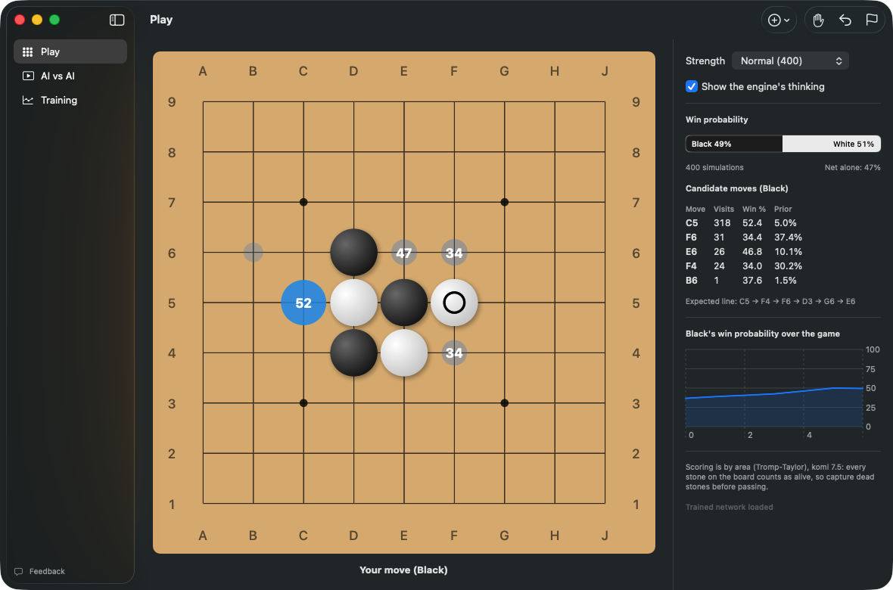
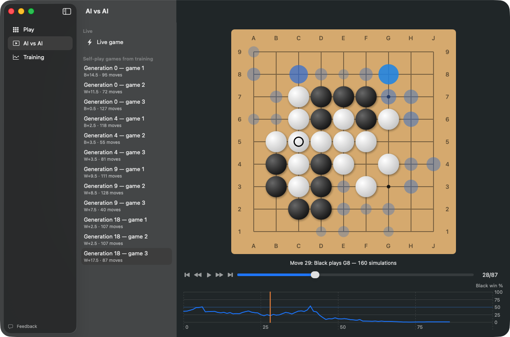
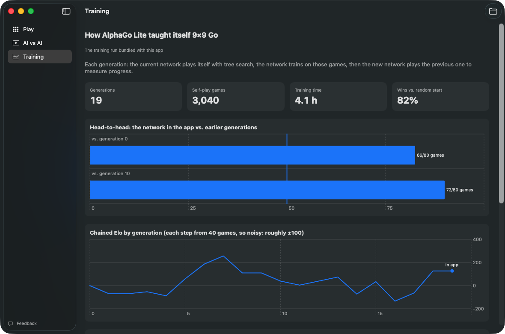
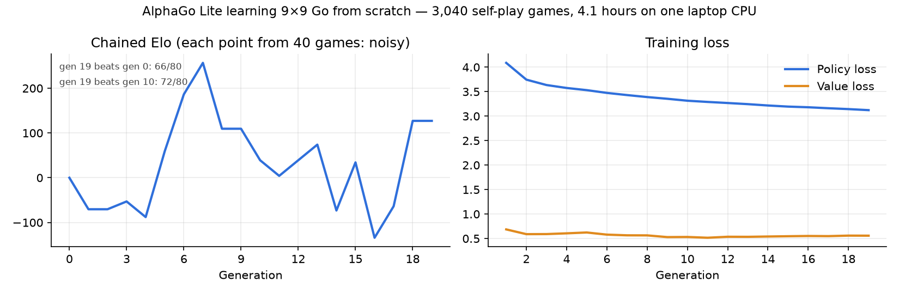
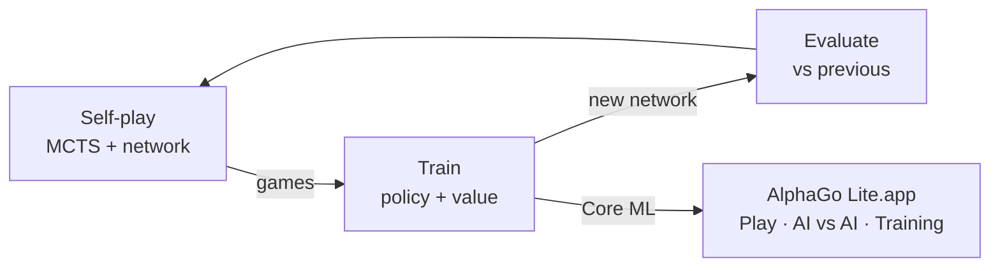

# AlphaGo Lite

A Mac app that plays 9×9 Go using the AlphaGo Zero algorithm. It taught itself from scratch through self-play on one laptop, and it shows you what it's thinking as it plays.

| Watch it play itself | See how it learned |
|---|---|
|  |  |

## Links

- [Instructions](docs/INSTRUCTIONS.md): build and run the app, how to play, how to retrain
- [System design](docs/SYSTEM-DESIGN.md): architecture, flows, decisions, limits
- [File structure](docs/FILE-STRUCTURE.md): what's where
- [Project brief](algha_go_lite.md)
